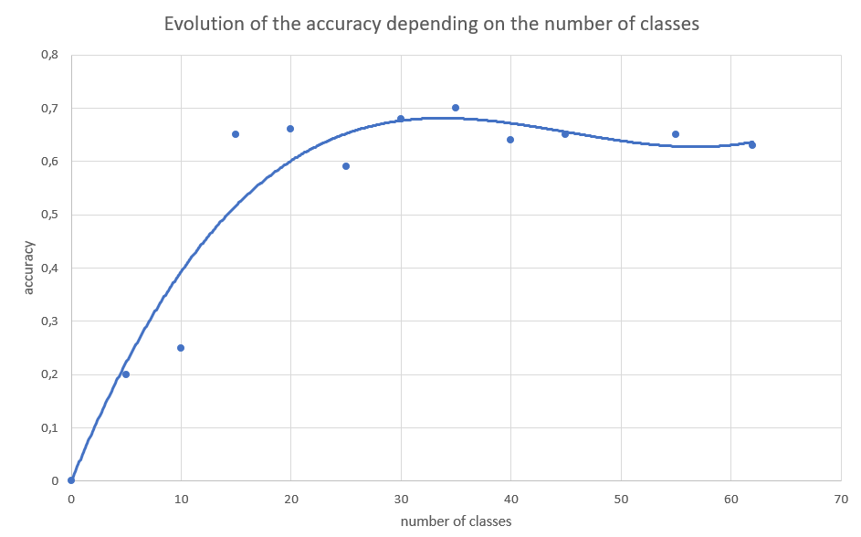
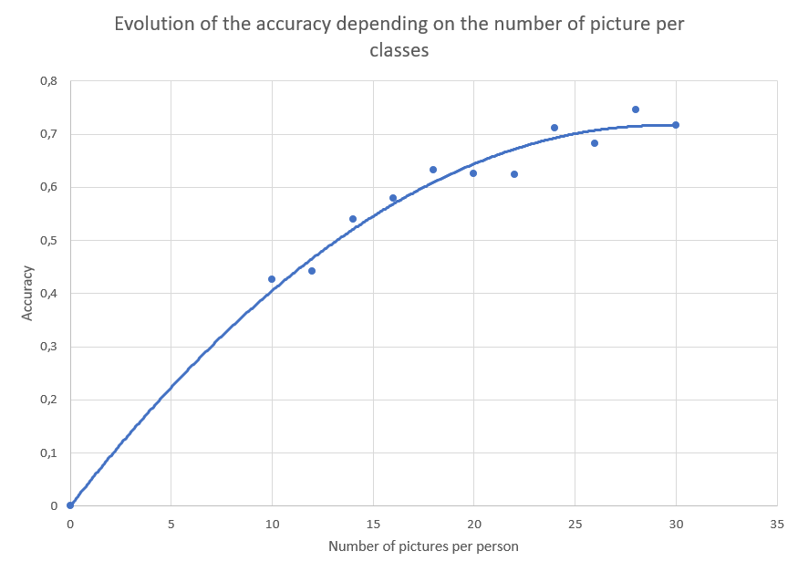
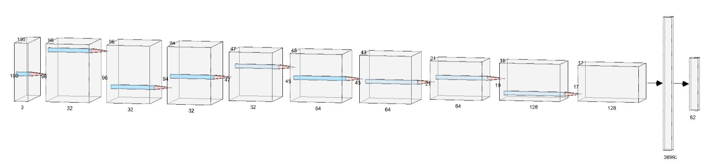
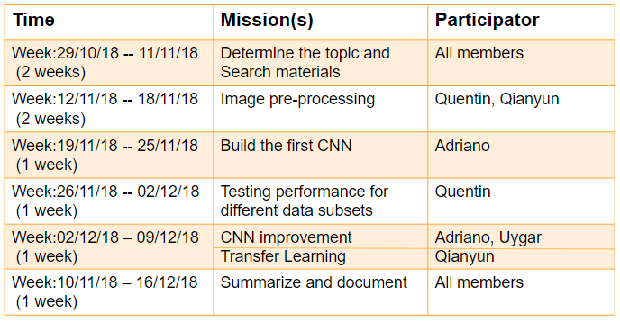

# Introduction 

The capabilities of humans may be insufficient in terms of understanding and comprehending really complex events. Face recognition systems are as a good tool to overcome such limitations. We interact with such systems on a daily as in surveillance, tracking, control etcetera.  Why are these systems so important? Because they have high accuracy, do not require contact and are able to perform detection from high distances. 

We are employing a convolutional neural network structure due to its usefulness for image processing. 

# Database 

The database we are using is Labeled Face in the Wild (LFW) database, presented by MIT. The database presents us images that are collected from celebrities on the web. In practice, the database presents a different amount of images from person to person; in total we are working with 13233 images for 5740 people.  
All the picture are yet processed in order to uniform the dimension of the images and the orientation of the faces.

Link to the database: http://vis-www.cs.umass.edu/lfw/

# Pre-processing 

Before using the picture in our system we implemented some improvement on the data to increase the final accuracy and the computing speed of our system. 

## Size and reshape

The first step is to reduce the database for two reasons : 
* Increase the computing speed of training 
* remove person's folder which have too low number of picture for training

This give us two parameters to play with : 
* The minimal number of picture each person should have (which act on the number of output class)
* The number of pictures per person

To found the best values of those we run two test only using balance database (same number of picture per person). 

### Optimal number of person (Classes)

For this test we use the same number of image per person and make the number of person (Classes) evolve from 
5 to 30. This is the curve we obtain : 

 

As we can see the accuracy increase until the maximal point then stabilize. This can be explain because a high number of 
classes create a higher number of parameter to train. 

### Optimal number of pictures per person (Sample per classes)
For the part we reverse the variable and the constant. We pick 34 classes and change the number of picture per person from 
10 to 30. This test give us the following classes : 

 

We can see as expected than the accuracy increase with the number of pictures increase the accuracy.

## Feature extraction

This part as two main purpose : 
* Decrease the number of parameter to train
* Remove useless information from pictures (background)

We first extract the face from the picture using the Haar cascade method. 
This system allow us to remove all the unused background but provide different size output based on the original image characteristic.
To get uniform input to our system we reshape all the image to 100x100pixel which is lower than all the possible size to 
avoid oversampling. 

We can also choose to use the pictures as Black and white pictures or keeping the RGB. This in fact didn't change the accuracy
of our system because by reducing the number of parameter (Black & White) we also decrease the amount of information. The computing speed 
is not really impacted by this changes. 

For this original image from the database : 

 

This system give us the following result : 

 

## Best system 

We've been looking for the optimal system for our network. We determine than choosing all the person which have more than
20 pictures (62 classes) and 20 pictures for each was the best system to use for the development period because of a 
high accuracy and a fast computing speed. But as final result we use an unbalanced dataset (same classes but a lot more
picture per classes) which give us  the best accuracy even if we loose computing speed. 

# The network structure

In order to get to the final structure of our network we started with a really basic CNN and proceeded adding layers and changing parameters in order to see what worked: in practice, if the accuracy improved after the change, we kept it, otherwise we just deleted it and went to check something else.
One of our attempts consisted on changing the size of the filters of the convolutional layers (we tried windows of size (5,5), (7,7) and (9,9)) but the results were not promising at all, so we decided to keep the minimum size (3,3).
Another attempt concerned the final part of the network; we tried to append in the end one or two dense layers but again we did not see any improvement, which is why we decided to keep them out.
The optimizer we employed was a quite standard Stochastic Gradient Descent, with a learning rate of 0.01, a decay for the rate of 10^-6 and Nesterov’s accelerated momentum with a parameter of 0.9. This was used for all our simulations (with the exception of some of the starting ones where we used for a bit an SGD(0.1)).
The maximum amount of epochs was set to 500 but such value was never reached as we were employing early stopping (with a value of patience equal to 20).
## Data Augmentation
Moreover, as the amount of data at our disposal was pretty small, we used data augmentation to boost the performance. We tested various parameters to see what helped and for each of the useful ones we looked for the best values. In practice we used horizontal_flip, zoom, width_shift_range and zoom_range, the actual values are of course on the code.

## Settings for the training
For the actual training on the augmented data we used a batch size of 128, and tuned the steps per epochs in order to get 4 times the original data; the validation steps per epoch were set to 50 and shuffle was enabled.

# Training approaches
The training is done in two phases. At first, we use the CNN we built and observe its performance using different datasets, and also check the impact of data augmentation on the whole. Then, we use Transfer Learning trying to improve our results. The loaded model is VGG19 and we use it first just for Feature Extraction and then to apply Fine Tuning.

## Transfer Learning
In this section, we use the weights pretrained in VGG19 to train the network; we do not import its 'head'. Codes are in file transfer_learning.py .

### Feature Extraction
We use the weights in the pretrained VGG19 and feed them to the Dense layer we decide.
Here we don't use the Data augmentation. And we reach an accuracy of 52.4%. 

### Fine Tuning
We start from the structure of Feature Extraction, we unfreeze the last block of VGG19 Network (a total of 4 convolutional layers) and we apply Data Augmentation.

# Results
For traning the Network, we use 20 images per class and totally 62 classes. In the CNN, before Data Augmentation we have an accuracy of 48.8%. After Data Augmentation, the performance improves to 72.6%.
Using Transfer Learning the accuracy reaches a value of 52.4% using Feature Extractions and increases to 70.6% with Fine Tuning.
Finally with the best weights we obtained an accuracy of 85.1% for the unbalanced number of imput images (which means using all the images of the people with at least 20 images).

# Conclusions

We created a sub-database with a reduced number of people and a balanced number of pictures.
We removed some useless information from the images and reshaped them in order to get a uniform input.
We built CNN and tuned most of its parameters.
Early stopping, L2 regularization and dropout were all used to prevent overfitting.
Dataset Augmentation improved the network performance.
We tried to implement Transfer Learning like Features Extraction and Fine-Tuning, but we did not manage to improve the performance.

# Reference
[1]. Keras documentation.  https://keras.io/

[2].Face Detection using Haar Cascades. https://opencv-python-tutroals.readthedocs.io/en/latest/py_tutorials/py_objdetect/py_face_detection/py_face_detection.html

[3]. Ian Goodfellow, Deep Learning.  http://www.deeplearningbook.org

[4]. Data base http://vis-www.cs.umass.edu/lfw/

[5]. Biometrics class in UPC

# Workload

The project took 8 weeks and we separated each part of the project to different time gaps. Also, there is a workload distribution among team members. The related schedule is represented as follows:

 

